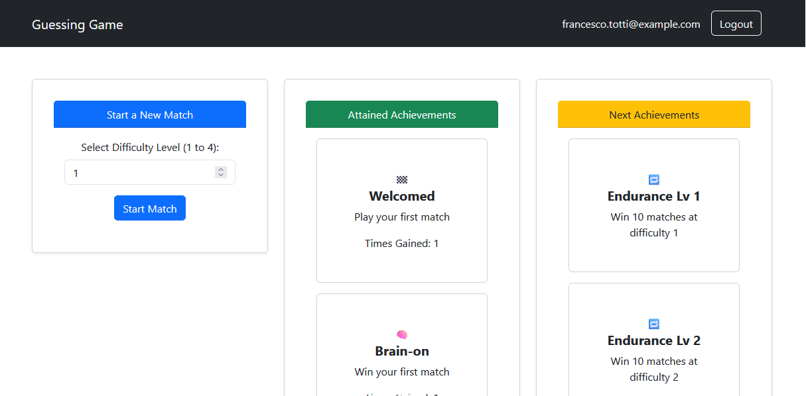
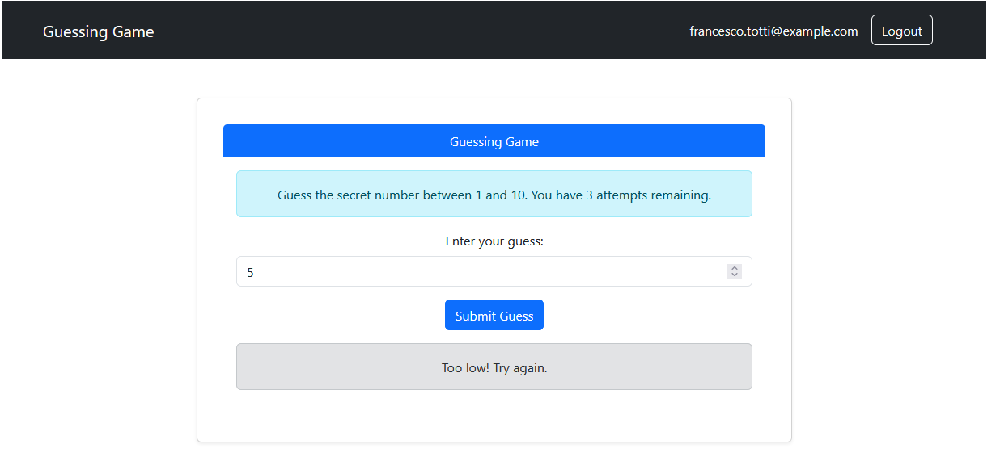

# Exam #4: "Achievements"
## Student: s323770 Faieta Luca 

## React Client Application Routes

- **Route `/`**:
- **Page Content**:Displays the `<PersonalPage>`Logged-in users are directed to their personal page where the user personal achievements are showed with also the ones that can be achieved in the future, there is also the option to start a game at a selected difficulty.
- **Purpose**: Display the gained achievement by the user, the one to be achieved and the possibility if starting a match selecting a difficulty.

- **Route `/play/:n/`**: 
- **Page Content**: Display the `<guessingGame>`.and when an achievement is gained it will also be shown at the end of the game with the possibility to return to the personal page or play another match at the same difficulty.
- **Purpose**: Play a match of guessing game. 
- **Parameter**: `n` is the selected difficulty for game by the user.

- **Route `/login`**:
  - **Page Content**:Displays the `<NonLoggedUserComponent>` for user login showing also a list of achievement that could be gained playing the game.. 
   - **Purpose**: Give not logged in users the possibility to log in and play the game.

- **Route `*` (Wildcard Route)**: 
  - **Page Content**: Displays the `<NotFoundLayout>` component, which shows a "Page Not Found" message.
  - **Purpose**: Handles any undefined routes and directs the user to a not found page.

## Main React Components

- `Header` (in `Header.jsx`): The style of the header of my page with the main functionality of containing the logout button to allow logged in users to logout.
- `NonLoggedUserComponent` (in `Login.jsx`): Allows not logged in users to login and play, it also shows the list of all the achieviements possible.
- `guessingGame` (in `matchComponent.jsx`): Permits to play a match of guessing game, at the end of the match if some new achievements are gained they will be shown giving the possibility to play another game at the same difficulty or return to the home; if no new achievement are gained there will be just the possibility of a new game or to return to the home.
- `PersonalPage` (in `homeComponent.jsx`): It's the homepage for logged in users where they can find they're gained achievements, the one to be gained and the possibility to start a new game selecting the difficulty.

## API Server
All the API's outside the one for logging in are accesible only for logged in users.
- **POST `/sessions`**: 
  - **Purpose**: Logs in a user.
  - **Parameters**: Expects a JSON object with `username` and `password` inside a `credentials` object.
  - **Response**: Returns user information upon successful login.

- **GET  `/sessions/current`**: 
  - **Purpose**: Verifies if the user is still logged in.
  - **Response**: Returns a JSON object with the current user’s information.

- **DELETE  `/sessions/current`**: 
  - **Purpose**: Logs out the current user by destroying their session.
  - **Response**: Does not return a body on success.
- **PUT `/api/match`**: 
  - **Purpose**: Starting the process of checking if new achievements are gained from the result of the current match.
  - **Parameters**: the match object that correspond to the info about the match just finished.
  - **Response**: A list with new achievements gained, could be empty if nothing is achieved.
- **GET `/api/allAchi`**: 
  - **Purpose**: retrieve all the possible achievements.
  - **Parameters**: No parameters necessary.
  - **Response**: A list with all the achievements present in the game.
- **GET `/api/userAchi`**: 
  - **Purpose**: retrieve all the user's achievements.
  - **Parameters**: user informations.
  - **Response**: A list with all the achievements gained by the user and one list with the achievements gainable by the user.

## Database Tables

- Table `user` - User info: id,email,salt and hashed password.

- Table `achievements` - The list of all possible achievements with the peculiar characteristics of an achievement like if it's repeatable or level dependable together with the id,condition,name and description.

- Table `user_achiements` -Links the user to each achievements with the number of times it is gained by that particular user.

- Table `user_match_info` -Stores the match informations of each difficulty that a user has. Used primarly controll the stats that could led the user to gain an achievement; it contains: user_id,difficulty,number of win (n_win), number of match played (n_match), how many consecutive perfect games the user has until that moment (perfect_streak), how many consecutives wins the user has until that moment (win_streak),how many consecutives losse the user has until that moment (loss_streak) and the outcome of the last game (last_match_results). Another use of this table is to maintain memory of the performance of the user in that difficulty giving the possibility to hop between different difficulties without losing streaks.

## Screenshots

*Screenshot 1: Homepage*

*Screenshot 2: During a game*

## Users Credentials

- francesco.totti@example.com, forzaRoma (played)
- luca.faieta@studenti.polito.it, politecnico (played)
- john.doe@example.com, webbapp1 (to be played)
